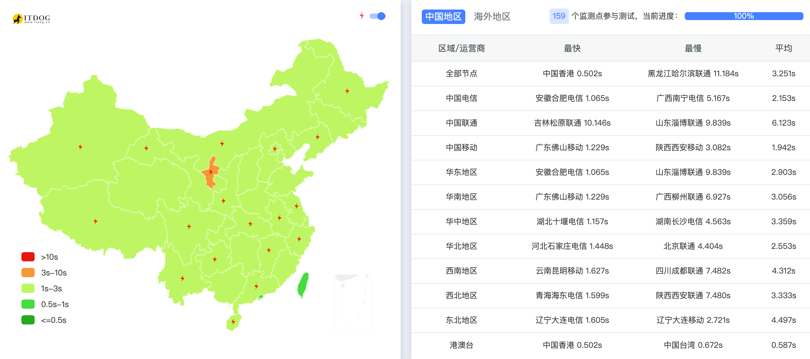

> **版本**: 2.0  
> **最后更新**: 2025-12-15  
> **状态**: ✅ 已实战验证可用  
> **架构**: Oracle Cloud (Japan) + Nginx 反向代理 + Cloudflare Workers (SNI Proxy)

---

## 1. 背景与目标

### 问题描述

Cloudflare 的免费版 CDN 节点在针对中国大陆访问时，通常会绕路美国西海岸或欧洲，导致：
- 高延迟（200ms+）
- 连接不稳定
- 易丢包

### 解决方案

利用地理位置靠近中国大陆、且国际出口带宽较好的 **Oracle Cloud Japan (甲骨文日本)** 服务器作为"中转跳板"，通过 Nginx 反向代理将流量转发至 **Cloudflare Workers**，从而实现更快的访问速度。

### 流量对比

**优化前 (常规模式)**:
```
用户 (大陆) 🐢 --> 太平洋海底光缆 --> Cloudflare (美国) --> Workers
延迟高，易丢包，体验差
```

**优化后 (本方案)**:
```
用户 (大陆) 🚀 --> 50-100ms --> Oracle VPS (日本) ⚡️ --> 5ms --> Cloudflare (日本边缘) --> Workers
利用 VPS 的优质线路中转，大幅降低物理延迟
```

---

## 2. 整体架构

### 2.1 架构图

```
用户
 └─ star.divinations.top        （灰云 DNS only → VPS）
     └─ Nginx 反向代理（SNI Proxy）
         └─ star-origin.divinations.top      （橙云 → Cloudflare Worker / Web）

用户
 └─ star-api.divinations.top    （灰云 DNS only → VPS）
     └─ Nginx 反向代理（SNI Proxy）
         └─ star-api-origin.divinations.top  （橙云 → Cloudflare Worker / API）
```

### 2.2 🔒 架构铁律（必须遵守）

| 规则 | 说明 |
|---|---|
| ✅ 入口域名永远是 **DNS only（灰云）** | star / star-api 必须灰云，用户直连 VPS |
| ✅ origin 域名永远是 **Proxied（橙云）** | 仅供 Nginx 后端使用，用户不可直接访问 |
| ❌ 用户请求永远不能被重定向到 origin 域名 | 否则触发 Cloudflare Error 1000 |
| ❌ 禁止入口域名开启橙云 | 否则直接 1000 错误 |
| ❌ 禁止 `star → CNAME → star-origin` | Cloudflare 会判定为非法代理 |

---

## 3. 准备工作

### 3.1 服务器要求

| 项目 | 要求 |
|---|---|
| 云服务商 | Oracle Cloud (日本/韩国/香港等亚太节点) |
| 操作系统 | Ubuntu 20.04/22.04 LTS |
| 端口 | 80, 443 必须开放 |
| 网络 | 确保服务器能正常访问 Cloudflare (1.1.1.1) |

### 3.2 域名规划

| 域名 | 用途 | 代理状态 |
|---|---|---|
| `star.divinations.top` | Web 主站入口 | DNS only (灰云) |
| `star-api.divinations.top` | API 入口 | DNS only (灰云) |
| `star-origin.divinations.top` | Web Workers 源站 | Proxied (橙云) |
| `star-api-origin.divinations.top` | API Workers 源站 | Proxied (橙云) |

### 3.3 软件依赖

```bash
# 更新系统
sudo apt update && sudo apt upgrade -y

# 安装必要软件
sudo apt install -y nginx certbot python3-certbot-nginx curl dnsutils
```

---

## 4. 详细实施步骤

### 第一步：Cloudflare DNS 设置 ⭐ 关键

在 Cloudflare 后台 DNS 设置中，**必须严格区分"直连"和"代理"状态**。

| 域名 | 类型 | 指向目标 | 代理状态 | 说明 |
|---|---|---|---|---|
| `star` | A | **Oracle 服务器 IP** | **DNS only (灰色云)** ☁️ | **关键**：必须关闭 CF 代理 |
| `star-api` | A | **Oracle 服务器 IP** | **DNS only (灰色云)** ☁️ | 同上 |
| `star-origin` | CNAME | `*.workers.dev` | **Proxied (橙色云)** 🟠 | Workers 必须开启代理 |
| `star-api-origin` | CNAME | `*.workers.dev` | **Proxied (橙色云)** 🟠 | 同上 |

**⚠️ 注意事项**：
- 入口域名（star / star-api）**禁止开启橙云**
- **禁止**设置 `star → CNAME → star-origin`
- 如存在 `AAAA star` IPv6 记录，需确认 IPv6 可用，否则删除

**验证 DNS 设置**：
```bash
# 验证入口域名指向 VPS IP
dig +short star.divinations.top @1.1.1.1
# 应该返回你的 VPS IP 地址

# 验证 origin 域名指向 Cloudflare
dig +short star-origin.divinations.top @1.1.1.1
# 应该返回 Cloudflare 的 IP 地址
```

---

### 第二步：服务器防火墙设置

在申请证书和部署 Nginx 前，**必须确保端口开放**。

#### 2.1 Oracle 云控制台 (网页端)

1. 登录 Oracle Cloud Console
2. 进入 `Networking` → `Virtual Cloud Networks` → 选择你的 VCN
3. 点击 `Security Lists` → 选择默认安全列表
4. 添加入站规则 (Ingress Rules)：

| 源 CIDR | 协议 | 目标端口 | 说明 |
|---|---|---|---|
| 0.0.0.0/0 | TCP | 80 | HTTP |
| 0.0.0.0/0 | TCP | 443 | HTTPS |

#### 2.2 服务器内部防火墙 (SSH)

```bash
# 方式一：如果使用 UFW
sudo ufw allow 80/tcp
sudo ufw allow 443/tcp
sudo ufw reload
sudo ufw status

# 方式二：如果使用 iptables (Oracle Ubuntu 默认)
# 查看当前规则
sudo iptables -L -n

# 添加规则
sudo iptables -I INPUT -p tcp --dport 80 -j ACCEPT
sudo iptables -I INPUT -p tcp --dport 443 -j ACCEPT

# 持久化规则
sudo apt install iptables-persistent
sudo netfilter-persistent save

# 或者直接清空所有规则（简单粗暴，仅测试用）
# sudo iptables -F
```

**验证端口开放**：
```bash
# 本地测试
nc -zv localhost 80
nc -zv localhost 443

# 外部测试（从另一台机器）
nc -zv <VPS_IP> 80
nc -zv <VPS_IP> 443
```

---

### 第三步：申请 SSL 证书

由于入口域名设置为"DNS only (灰云)"，浏览器会直接校验 Oracle 服务器上的证书，**必须使用受信任的证书**。

```bash
# 1. 确保 Nginx 已启动（Certbot 需要验证）
sudo systemctl start nginx

# 2. 申请证书 - Web 站
sudo certbot --nginx -d star.divinations.top

# 3. 申请证书 - API 站（单独证书，避免 SAN 问题）
sudo certbot --nginx -d star-api.divinations.top

# 4. 验证证书
sudo certbot certificates
```

**⚠️ 证书申请前检查清单**：
- [ ] Cloudflare DNS 已设置为灰云
- [ ] 防火墙 80/443 端口已开放
- [ ] Nginx 已启动且 80 端口可访问
- [ ] 域名已正确解析到 VPS IP

**证书续期测试**：
```bash
sudo certbot renew --dry-run
```

---

### 第四步：Nginx 配置 ⭐ 核心

#### 4.1 Web 入口配置

**文件路径**: `/etc/nginx/sites-available/star.divinations.top`

```nginx
# HTTP 强制跳转 HTTPS
server {
    listen 80;
    listen [::]:80;
    server_name star.divinations.top;
    return 301 https://$host$request_uri;
}

# HTTPS 主配置
server {
    listen 443 ssl http2;
    listen [::]:443 ssl http2;
    server_name star.divinations.top;

    # SSL 证书（Certbot 自动配置）
    ssl_certificate /etc/letsencrypt/live/star.divinations.top/fullchain.pem;
    ssl_certificate_key /etc/letsencrypt/live/star.divinations.top/privkey.pem;
    
    # SSL 优化设置
    ssl_protocols TLSv1.2 TLSv1.3;
    ssl_ciphers HIGH:!aNULL:!MD5;
    ssl_prefer_server_ciphers on;
    ssl_session_cache shared:SSL:10m;
    ssl_session_timeout 10m;

    location / {
        # ⭐ 关键：动态 DNS 解析（必须配置）
        resolver 1.1.1.1 8.8.8.8 valid=300s ipv6=off;
        resolver_timeout 5s;

        # 调试 Header（可选，生产环境可删除）
        add_header X-Star-Proxy "vps-nginx" always;

        # 转发目标：指向 Workers 的源域名
        proxy_pass https://star-origin.divinations.top;

        # ⭐ 核心：SNI 设置（必须开启，否则 CF 握手失败）
        proxy_ssl_server_name on;
        proxy_ssl_name star-origin.divinations.top;
        
        # 传递 Host 头
        proxy_set_header Host star-origin.divinations.top;

        # 传递用户真实 IP
        proxy_set_header X-Real-IP $remote_addr;
        proxy_set_header X-Forwarded-For $proxy_add_x_forwarded_for;
        proxy_set_header X-Forwarded-Proto $scheme;
        proxy_set_header X-Forwarded-Host $host;

        # 超时设置
        proxy_connect_timeout 10s;
        proxy_send_timeout 30s;
        proxy_read_timeout 30s;

        # 长连接优化
        proxy_http_version 1.1;
        proxy_set_header Connection "";
    }
}
```

#### 4.2 API 入口配置

**文件路径**: `/etc/nginx/sites-available/star-api.divinations.top`

```nginx
# HTTP 强制跳转 HTTPS
server {
    listen 80;
    listen [::]:80;
    server_name star-api.divinations.top;
    return 301 https://$host$request_uri;
}

# HTTPS 主配置
server {
    listen 443 ssl http2;
    listen [::]:443 ssl http2;
    server_name star-api.divinations.top;

    # SSL 证书
    ssl_certificate /etc/letsencrypt/live/star-api.divinations.top/fullchain.pem;
    ssl_certificate_key /etc/letsencrypt/live/star-api.divinations.top/privkey.pem;
    
    # SSL 优化设置
    ssl_protocols TLSv1.2 TLSv1.3;
    ssl_ciphers HIGH:!aNULL:!MD5;
    ssl_prefer_server_ciphers on;
    ssl_session_cache shared:SSL:10m;
    ssl_session_timeout 10m;

    location / {
        # ⭐ 关键：动态 DNS 解析
        resolver 1.1.1.1 8.8.8.8 valid=300s ipv6=off;
        resolver_timeout 5s;

        # 调试 Header
        add_header X-Star-Proxy "vps-nginx-api" always;

        # 转发目标
        proxy_pass https://star-api-origin.divinations.top;

        # ⭐ 核心：SNI 设置
        proxy_ssl_server_name on;
        proxy_ssl_name star-api-origin.divinations.top;
        
        # 传递 Host 头
        proxy_set_header Host star-api-origin.divinations.top;

        # 传递用户真实 IP
        proxy_set_header X-Real-IP $remote_addr;
        proxy_set_header X-Forwarded-For $proxy_add_x_forwarded_for;
        proxy_set_header X-Forwarded-Proto $scheme;
        proxy_set_header X-Forwarded-Host $host;

        # 超时设置
        proxy_connect_timeout 10s;
        proxy_send_timeout 30s;
        proxy_read_timeout 30s;

        # 长连接优化
        proxy_http_version 1.1;
        proxy_set_header Connection "";
    }
}
```

#### 4.3 启用配置

```bash
# 创建软链接
sudo ln -sf /etc/nginx/sites-available/star.divinations.top /etc/nginx/sites-enabled/
sudo ln -sf /etc/nginx/sites-available/star-api.divinations.top /etc/nginx/sites-enabled/

# 删除默认配置（可选）
sudo rm -f /etc/nginx/sites-enabled/default

# 检查语法
sudo nginx -t

# 重新加载配置
sudo systemctl reload nginx
```

#### 4.4 🚫 Nginx 配置禁止事项

| 禁止项 | 原因 |
|---|---|
| `proxy_set_header CF-Connecting-IP ...` | 伪造 CF 专用 Header 会触发 403 |
| 入口域名 301/302 到 origin | 会触发 Error 1000 |
| WebSocket Header 无条件开启 | 普通 HTTP 被强制 upgrade 会出错 |
| proxy_pass 不配 resolver | DNS 只解析一次，后续可能失效 |

---

### 第五步：Cloudflare Worker 配置

#### 5.1 Worker 使用规范

- Worker 只负责业务逻辑
- **不依赖** `CF-Connecting-IP`（该 Header 由 Cloudflare 自动注入，VPS 无法伪造）
- 使用 `X-Forwarded-For` / `X-Real-IP` 获取真实用户 IP
- 如需防止直连 origin，可校验 Nginx 注入的自定义 Header

#### 5.2 Worker 获取真实 IP 示例

```typescript
// 在 Worker 中获取真实用户 IP
function getClientIP(request: Request): string {
  // 优先使用 Nginx 传递的 Header
  const xRealIP = request.headers.get('X-Real-IP');
  if (xRealIP) return xRealIP;
  
  const xForwardedFor = request.headers.get('X-Forwarded-For');
  if (xForwardedFor) {
    return xForwardedFor.split(',')[0].trim();
  }
  
  // 最后使用 Cloudflare 的 Header（直连 Workers 时有效）
  return request.headers.get('CF-Connecting-IP') || 'unknown';
}
```

---

## 5. 验证与测试

### 5.1 DNS 验证

```bash
# 验证入口域名
dig +short star.divinations.top @1.1.1.1
# 应返回 VPS IP

# 验证 origin 域名
dig +short star-origin.divinations.top @1.1.1.1
# 应返回 Cloudflare IP
```

### 5.2 HTTP 验证

```bash
# 测试 Web 入口
curl -I https://star.divinations.top

# 测试 API 入口
curl -I https://star-api.divinations.top

# 测试 origin（仅测试用）
curl -I https://star-origin.divinations.top
```

### 5.3 预期响应

正常情况下应该看到：
- HTTP/2 200
- 响应头包含 `X-Star-Proxy: vps-nginx`
- 无 403/502/521/522/1000 错误

### 5.4 延迟测试

```bash
# 从大陆服务器测试
curl -w "@-" -o /dev/null -s https://star.divinations.top <<'EOF'
    time_namelookup:  %{time_namelookup}s\n
       time_connect:  %{time_connect}s\n
    time_appconnect:  %{time_appconnect}s\n
   time_pretransfer:  %{time_pretransfer}s\n
      time_redirect:  %{time_redirect}s\n
 time_starttransfer:  %{time_starttransfer}s\n
                    ----------\n
         time_total:  %{time_total}s\n
EOF
```

---

## 6. 维护指南

### 6.1 证书续期

Certbot 会自动添加定时任务，但建议定期检查：

```bash
# 测试续期
sudo certbot renew --dry-run

# 查看定时任务
sudo systemctl list-timers | grep certbot

# 手动续期（如需要）
sudo certbot renew
```

### 6.2 Nginx 日志

```bash
# 查看访问日志
sudo tail -f /var/log/nginx/access.log

# 查看错误日志
sudo tail -f /var/log/nginx/error.log
```

### 6.3 Nginx 管理命令

```bash
# 检查配置语法
sudo nginx -t

# 重新加载配置（不中断服务）
sudo systemctl reload nginx

# 重启 Nginx
sudo systemctl restart nginx

# 查看状态
sudo systemctl status nginx
```

---

## 7. ⚠️ 实战踩坑记录（必读）

以下是实际部署过程中遇到的坑，请务必避免！

### 7.1 入口域名误开启橙云 → Error 1000

**现象**：访问入口域名直接报 Cloudflare Error 1000

**原因**：入口域名被 Cloudflare 代理，指向 VPS → Cloudflare 判定为非法

**解决**：入口域名（star / star-api）**永远设置为灰云 (DNS only)**

---

### 7.2 入口域名跳转到 origin → Error 1000

**错误配置**：
```nginx
# ❌ 错误！不要这样做
server {
    server_name star.divinations.top;
    return 301 https://star-origin.divinations.top$request_uri;
}
```

**原因**：Cloudflare 判定为非法代理跳转

**解决**：origin 域名**只给后端使用**，用户请求永远不要重定向到 origin

---

### 7.3 伪造 CF-Connecting-IP → 403

**错误配置**：
```nginx
# ❌ 错误！不要这样做
proxy_set_header CF-Connecting-IP $remote_addr;
```

**原因**：CF-Connecting-IP 是 Cloudflare 专用 Header，伪造会被识别并拒绝

**解决**：**永远不要手动设置 CF-Connecting-IP**，使用 X-Real-IP 代替

---

### 7.4 proxy_pass 无 resolver → DNS 玄学

**现象**：Nginx 运行一段时间后 502，重启后恢复

**原因**：Nginx 启动时只解析一次域名并缓存，Cloudflare IP 变化后无法更新

**解决**：**必须配置 resolver**
```nginx
resolver 1.1.1.1 8.8.8.8 valid=300s ipv6=off;
resolver_timeout 5s;
```

---

### 7.5 Worker 域名在部分 DNS 下不可解析

**现象**：某些企业 DNS 返回 NXDOMAIN

**原因**：Workers 绑定域的 DNS 记录可能有兼容性问题

**解决**：统一使用 **CNAME → *.workers.dev**

---

### 7.6 WebSocket Header 滥用

**错误配置**：
```nginx
# ❌ 错误！不要无条件开启
proxy_set_header Upgrade $http_upgrade;
proxy_set_header Connection "upgrade";
```

**原因**：普通 HTTP 请求被强制 upgrade 会出错

**解决**：如果不用 WebSocket 就删除这些配置；如果需要，使用 map 条件判断

---

### 7.7 证书 SAN 未覆盖 API 域名

**现象**：API 域名 SSL 握手失败

**原因**：API 域复用 Web 证书，但 SAN (Subject Alternative Name) 不包含 API 域

**解决**：为 API 单独申请证书，或确认 SAN 包含所有域名

```bash
# 查看证书包含的域名
openssl x509 -in /etc/letsencrypt/live/star.divinations.top/fullchain.pem -text | grep -A1 "Subject Alternative Name"
```

---

### 7.8 Oracle 防火墙未配置

**现象**：外部无法访问 80/443 端口

**原因**：Oracle Cloud 有两层防火墙 - 云控制台 Security List + 服务器内部 iptables

**解决**：两层都要配置！参见第二步

---

### 7.9 Nginx SSL 证书路径错误

**现象**：Nginx 启动失败，报证书文件不存在

**原因**：Certbot 证书路径和配置中的路径不一致

**解决**：确认证书实际路径
```bash
sudo ls -la /etc/letsencrypt/live/
```

---

## 8. 故障排查手册

### 8.1 Error 502 Bad Gateway

**可能原因**：
1. VPS 无法连接到 Cloudflare
2. resolver 未配置
3. origin 域名解析失败

**排查步骤**：
```bash
# 1. 测试 DNS 解析
dig +short star-origin.divinations.top @1.1.1.1

# 2. 测试 VPS 到 Cloudflare 的连接
curl -I https://star-origin.divinations.top

# 3. 检查 Nginx 错误日志
sudo tail -f /var/log/nginx/error.log

# 4. 检查 VPS DNS 设置
cat /etc/resolv.conf
# 如有问题，修改为：
# nameserver 1.1.1.1
# nameserver 8.8.8.8
```

---

### 8.2 Error 521 / 522

**可能原因**：
1. Worker 未响应
2. `proxy_ssl_server_name on;` 未配置
3. origin 域名配置错误

**排查步骤**：
```bash
# 1. 检查 Nginx 配置
sudo nginx -t
grep -r "proxy_ssl_server_name" /etc/nginx/

# 2. 直接测试 origin
curl -I https://star-origin.divinations.top

# 3. 检查 Worker 状态（Cloudflare Dashboard）
```

---

### 8.3 Error 1000

**可能原因**：
1. 入口域名开启了橙云
2. 存在重定向到 origin 的配置

**排查步骤**：
```bash
# 1. 检查 DNS 代理状态（Cloudflare Dashboard）
# 入口域名必须是灰云

# 2. 检查 Nginx 是否有重定向
grep -r "301\|302\|return" /etc/nginx/sites-enabled/
```

---

### 8.4 Error 403

**可能原因**：
1. 伪造了 CF-Connecting-IP
2. Cloudflare 安全规则拦截

**排查步骤**：
```bash
# 检查是否设置了禁止的 Header
grep -r "CF-Connecting-IP" /etc/nginx/
```

---

### 8.5 SSL 证书错误

**可能原因**：
1. 证书过期
2. 证书路径错误
3. 证书不包含请求的域名

**排查步骤**：
```bash
# 1. 查看证书状态
sudo certbot certificates

# 2. 查看证书详情
openssl x509 -in /etc/letsencrypt/live/star.divinations.top/fullchain.pem -text -noout | head -30

# 3. 测试 SSL 连接
openssl s_client -connect star.divinations.top:443 -servername star.divinations.top
```

---

## 9. 方案优缺点分析

### ✅ 优点

| 优点 | 说明 |
|---|---|
| 🚀 速度快 | 大陆用户直连亚洲 VPS，绕过 Cloudflare 拥堵节点 |
| 📶 更稳定 | TCP 连接建立在 VPS 上，VPS 到 CF 走骨干网，丢包率低 |
| 🔒 合规 SSL | 使用 Let's Encrypt 真实证书，浏览器不报红，支持 HTTP/2 |
| 💰 成本低 | Oracle Cloud 永久免费层足够使用 |

### ⚠️ 风险与缺点

| 风险 | 说明 | 缓解措施 |
|---|---|---|
| 真实 IP 暴露 | 入口域名解析到 VPS 真实 IP，可能遭受 DDoS | 使用 Oracle 的 DDoS 防护，或准备备用 IP |
| VPS 维护成本 | 需自行维护服务器安全、系统更新 | 配置自动更新，定期巡检 |
| IP 被墙风险 | 热门号段 IP 可能被阻断 | 准备多个 VPS，配置故障转移 |
| 证书续期 | 虽然自动，但仍需监控 | 配置监控告警 |

---

## 10. 最终总结

> **Cloudflare 大多数"玄学问题"，本质不是网络，而是：**
> - 入口与源站边界混乱
> - Header 伪造
> - 重定向错误
> - DNS / TLS 细节遗漏

### 核心要点速查

| 项目 | 正确配置 |
|---|---|
| 入口域名代理状态 | DNS only (灰云) |
| origin 域名代理状态 | Proxied (橙云) |
| Nginx resolver | 必须配置 1.1.1.1 8.8.8.8 |
| proxy_ssl_server_name | 必须 on |
| CF-Connecting-IP | 禁止手动设置 |
| 入口到 origin 重定向 | 禁止 |

---

**这份文档 = 已验证可长期复用的 SOP (标准操作流程)**

如有问题，请按照第 8 节故障排查手册进行排查。

---

## 📊 优化效果对比

通过本方案优化后，网站访问速度有了显著提升。以下是优化前后的测速对比数据：

### 优化前测速截图

<!-- 📌 请在此处插入优化前的测速截图 -->


### 优化后测速截图

<!-- 📌 请在此处插入优化后的测速截图 -->


---

## 🌟 欢迎体验我的视频网站

如果你觉得这篇文章对你有帮助，欢迎访问我使用本方案优化后的视频网站：

<div align="center">

### 🎬 [star.divinations.top](https://star.divinations.top)

**高速流畅的在线视频播放体验**

</div>

本站使用上述方案进行了网络优化，大陆用户可以享受低延迟、高速度的访问体验。快来试试吧！ 🚀
